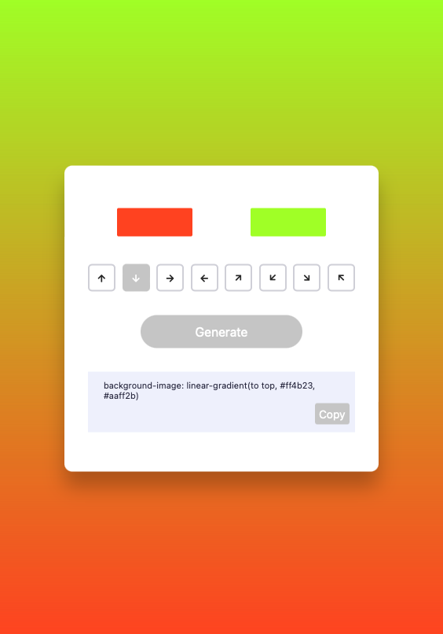

# Gradient Generator

A gradient generator application allowing users to select colors and generate corresponding gradients. Users can copy the generated gradient code to the clipboard for easy integration into their projects.

### Demo

https://szymongonet.github.io/gradient-generator/

### Screenshot

